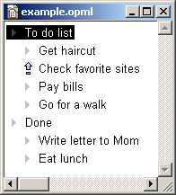

OPML 1.0
********

..  note::

    The OPML 1.0 specification is available at:

    `<http://2005.opml.org/spec1.html>`_

    It is copied here for posterity under the terms at the bottom of this page.

About this document
=====================================

This document describes a format for storing outlines in XML 1.0
called *Outline Processor Markup Language* or OPML.

For the purposes of this document, an outline is a tree,
where each node contains a set of named attributes with string values.

Timeline
========

Outlines have been a popular way to organize information on computers for a long time.
While the history of outlining software is unclear, a rough timeline is possible.

Probably the first outliner was developed by Doug Engelbart,
as part of the Augment system in the 1960s.

Living Videotext, 1981-87, developed several popular outliners for personal computers.
They are archived on a UserLand website, outliners.com.

Frontier, first shipped in 1992, is built around outlining.
The text, menu and script editors in Frontier are outliners, as is the object database browser.

XML 1.0, the format that OPML is based on, is a recommendation of the W3C.

Radio UserLand, first shipped in March 2001, is an outliner whose native file format is OPML.

OPML is used for directories in Manila.

Examples
========

Outlines can be used for specifications, legal briefs, product plans, presentations, screenplays,
directories, diaries, discussion groups, chat systems and stories.

Outliners are programs that allow you to read, edit and reorganize outlines.

Examples of OPML documents: `play list`_, `specification`_, `presentation`_.

Goals of the OPML format
========================

The purpose of this format is to provide a way to exchange information between outliners
and Internet services that can be browsed or controlled through an outliner.

The design goal is to have a transparently simple, self-documenting, extensible and human readable format
that's capable of representing a wide variety of data that's easily browsed and edited.
As the format evolves this goal will be preserved.
It should be possible for a reasonably technical person to fully understand the format
with a quick read of a single Web page.

It's an open format, meaning that other outliner vendors and service developers are free to use the format
to be compatible with Radio UserLand or for any other purpose.

What is an <opml>?
==================

<opml> is an XML element, with a single required attribute, version;
a <head> element and a <body> element, both of which are required.

The version attribute is a version string, of the form, x.y,
where x and y are both numeric strings.

What is a <head>?
=================

A <head> contains zero or more optional elements, described below.

<title> is the title of the document.

<dateCreated> is a date-time, indicating when the document was created.

<dateModified> is a date-time, indicating when the document was last modified.

<ownerName> is a string, the owner of the document.

<ownerEmail> is a string, the email address of the owner of the document.

<expansionState> is a comma-separated list of line numbers that are expanded.
The line numbers in the list tell you which headlines to expand.
The order is important.
For each element in the list, X, starting at the first summit, navigate flatdown X times and expand.
Repeat for each element in the list.

<vertScrollState> is a number, saying which line of the outline is displayed on the top line of the window.
This number is calculated with the expansion state already applied.

<windowTop> is a number, the pixel location of the top edge of the window.

<windowLeft> is a number, the pixel location of the left edge of the window.

<windowBottom> is a number, the pixel location of the bottom edge of the window.

<windowRight> is a number, the pixel location of the right edge of the window.

<head> notes
============

All the sub-elements of <head> may be ignored by the processor.
If an outline is opened within another outline, the processor must ignore the windowXxx elements,
those elements only control the size and position of outlines that are opened in their own windows.

All date-times conform to the Date and Time Specification of `RFC 822`_.

If you load an OPML document into your client, you may choose to respect expansionState, or not.
We're not in any way trying to dictate user experience.
The expansionState info is there because it's needed in certain contexts.
It's easy to imagine contexts where it would make sense to completely ignore it.

What is a <body>?
=================

A <body> contains one or more <outline> elements.

What is an <outline>?
=====================

An <outline> is an XML element, possibly containing one or more attributes,
and containing any number of <outline> sub-elements.

Common attributes
=================

text is the string of characters that's displayed when the outline is being browsed or edited.
There is no specific limit on the length of the text attribute.

type is a string, it says how the other attributes of the <outline> are interpreted.

isComment is a string, either "true" or "false", indicating whether the outline is commented or not.
By convention if an outline is commented, all subordinate outlines are considered to be commented as well.
If it's not present, the value is false.

isBreakpoint is a string, either "true" or "false", indicating whether a breakpoint is set on this outline.
This attribute is mainly necessary for outlines used to edit scripts that execute.
If it's not present, the value is false.

Compatibility
=============

Before the 1.0 format was frozen the top-level element of the format was called outlineDocument.
Radio UserLand will continue to read such documents.

Limits
======

There are no documented limits to the number of attributes an <outline> element can have,
or the number of <outline> elements it can contain.

Notes
=====

OPML is a file format, not a protocol.
When you click on a link in an HTML document it doesn't in any way change the document stored on the server.
OPML is used in much the same way.

Wayne Steele did a `DTD`_ for OPML 1.0.
Thank you.

In general, the mimetype for an OPML document, when accessed over HTTP, is ``text/xml``.
This allows Web browsers to use XML formatting conventions to display an OPML document.
Radio UserLand's built-in HTTP server looks at the Accept header of the request to determine how it processes an OPML document.
If the Accept header says that the client understands ``text/x-opml``, we return the unprocessed XML text.
If it is not present, we return the text in the outline with the mimetype ``text/html``.

Copyright and disclaimer
========================

Copyright 2000 UserLand Software, Inc. All Rights Reserved.

This document and translations of it may be copied and furnished to others,
and derivative works that comment on or otherwise explain it or assist in its implementation
may be prepared, copied, published and distributed, in whole or in part, without restriction of any kind,
provided that the above copyright notice and these paragraphs are included on all such copies and derivative works.

This document may not be modified in any way, such as by removing the copyright notice or references to UserLand or other organizations.
Further, while these copyright restrictions apply to the written OPML specification,
no claim of ownership is made by UserLand to the format it describes.
Any party may, for commercial or non-commercial purposes, implement this protocol without royalty or license fee to UserLand.
The limited permissions granted herein are perpetual and will not be revoked by UserLand or its successors or assigns.

This document and the information contained herein is provided on an "AS IS" basis
and USERLAND DISCLAIMS ALL WARRANTIES, EXPRESS OR IMPLIED, INCLUDING BUT NOT LIMITED TO ANY WARRANTY
THAT THE USE OF THE INFORMATION HEREIN WILL NOT INFRINGE ANY RIGHTS OR ANY IMPLIED WARRANTIES OF MERCHANTABILITY
OR FITNESS FOR A PARTICULAR PURPOSE.

..  _play list: http://2005.opml.org/examples/playlist.opml
..  _specification: http://2005.opml.org/examples/specification.opml
..  _presentation: http://2005.opml.org/examples/presentation.opml
..  _RFC 822: https://datatracker.ietf.org/doc/html/rfc822#section-5
..  _DTD: http://2005.opml.org/examples/opmlDtd.txt
